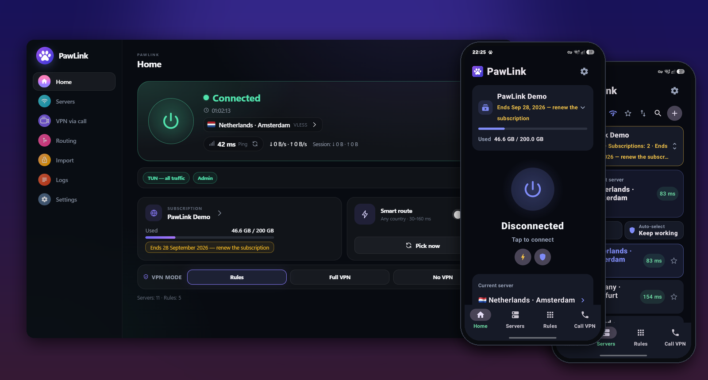
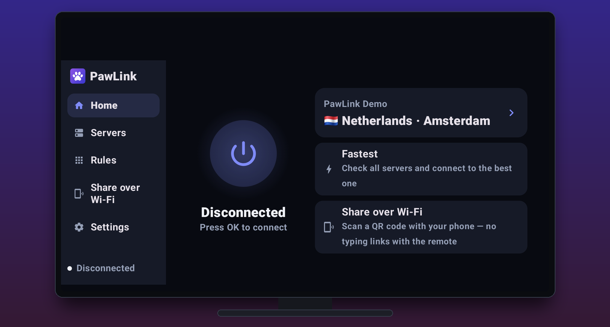

  <strong>English</strong> · <a href="README.md">Русский</a>

  

<h1 align="center">PawLink</h1>

  <b>A convenient and simple VPN client</b> 
  For Windows, Android and Android TV

  
  

  The button downloads the latest version right away. All versions and what's new are on the <a href="../../releases">releases</a> page.

  

## 🐾 Three steps and you're online

| 1. Download | 2. Paste your link | 3. Press the button |
|:---:|:---:|:---:|
| With the button above, for PC or phone | The one your VPN provider gave you. On a phone just tap Share → PawLink or scan a QR code | One big button. Green means it works |

That's all the setup there is. Servers, updates and reconnects are PawLink's job.

## Why PawLink

**🟢 Nothing to figure out.** No configs, no mysterious checkboxes. The button colour tells the story: green — working, yellow — connecting, red — something's wrong, and PawLink tells you what.

**⚡ Picks the best server for you.** If a server goes down or gets slow, PawLink quietly moves to a working one. You won't even notice.

**📶 Stays connected.** Switched from Wi-Fi to mobile data, went into the subway, left the phone in your pocket — the connection comes back on its own.

**📞 Works on whitelisted networks.** When mobile internet only lets you reach "approved" sites, ordinary VPNs stop working. PawLink has a **VPN over a call** mode: to the network your traffic looks like a regular VK video call, so it gets through where everything else is blocked.

**🎯 Rules without the pain.** Want only YouTube to go through the VPN? Type one word — `youtube` — and PawLink understands it means every YouTube site and video server. You can also paste a link to a site or pick a ready-made rule preset. On a phone, tick the apps you need or tap "Select recommended apps". Everything else, LAN games included, works directly.

**🚫 Fewer ads.** Ad blocking is one switch away.

**📺 On your TV too.** The same PawLink installs on Android TV and TV boxes. TV mode gives big buttons, a side menu and remote control navigation. No typing a subscription with the remote — scan the QR code on the TV screen with your phone or enter 8 digits, and PawLink moves the servers over Wi-Fi.

  

## Who it's for

- You already have a VPN subscription and want a friendly app instead of "whatever someone recommended in a chat".
- Your mobile internet works on a whitelist. If you have your own server, PawLink will set up VPN over a call on it and make QR-code links for friends and family — you only type the server address and password.

## FAQ

<b>Where do I get a subscription link?</b>

 
PawLink is the app you connect with, not a VPN provider. The link comes from the service you bought your VPN from (usually in your account page or a Telegram bot). PawLink understands all popular protocols — VLESS (including Reality), VMess, Trojan, Shadowsocks, Hysteria2, TUIC, WireGuard and AmneziaWG, SOCKS and HTTP — in any form: a subscription link, a single key like <code>vless://…</code>, a QR code, a Clash or WireGuard file.

<b>Windows says "Windows protected your PC"</b>

 
That's how Windows treats new programs without a paid signature. Click "More info" → "Run anyway". Administrator rights are needed so that all traffic, games included, goes through the VPN.

<b>My phone says the install is blocked</b>

 
That's how Android guards against apps from outside Google Play — you allow it once. In the window that appears tap "Settings", turn on "Allow from this source", go back and tap "Install". After that PawLink updates itself, right inside the app.

<b>The VPN turns off in the background on my phone</b>

 
On first launch PawLink shows what to change: turn off battery optimisation for PawLink and "Always-on VPN" for other apps. After that the connection stays up even when the app is closed.

<b>Some app doesn't work while the VPN is on</b>

 
Some apps (banking ones, for example) dislike VPNs — just keep them out of it. On the phone open the Rules tab and choose "Only selected apps use VPN": only the apps you tick go through the VPN, everything else works as usual. Some apps notice that a VPN is on even when their own traffic goes direct. For them Settings has "Hide VPN from apps": no system VPN is created, and only apps with a proxy set go through PawLink.

<b>What do I need for my own VPN-over-a-call server?</b>

 
Any cheap VPS: 1 core, 512 MB of RAM or more, Ubuntu 22.04 or 24.04 and access with a password or key. PawLink installs everything else. The server password is stored encrypted only on your device and never ends up in links you share.

<b>The PC update is stuck at 0 % (version 2.2.4)</b>

 
Version 2.2.4 downloads updates outside the VPN, and with some providers the download from GitHub stalls. Options: on the Home screen switch the mode to "Full VPN" and press "Update" again; or disconnect the VPN and update; or download the installer with the "Download for Windows" button at the top of this page and run it — PawLink updates in place, settings and subscriptions are kept. Starting with 2.2.5 updates go through the VPN, resume after a break and retry by themselves.

<b>How do I install PawLink on a TV?</b>

 
Download the Android file and install it on your Android TV or TV box (for example, from a USB stick or with a file transfer app). On first launch PawLink offers TV mode — you can also turn it on later in the settings. The easiest way to add servers is from your phone: open "Share over Wi-Fi" on the TV, then on the phone tap "+" → "Share over Wi-Fi" → "Send" and scan the QR code.

<b>Is it free?</b>

 
Yes. No ads, no sign-up, no data collection.

## Found a bug or have an idea?

Open an [issue](https://github.com/FelixEnotix/PawLink/issues) with a screenshot and what you were doing. It helps a lot.

  If PawLink helped you, give it a ⭐ so others can find it too.

---

VPN over a call is based on <a href="https://github.com/Ivan4537/WDTT-Plus">WDTT-Plus</a> (GPLv3). Flags on Windows use the Twemoji Country Flags font (CC-BY 4.0). License details are in the <a href="LICENSE">LICENSE</a> file.
