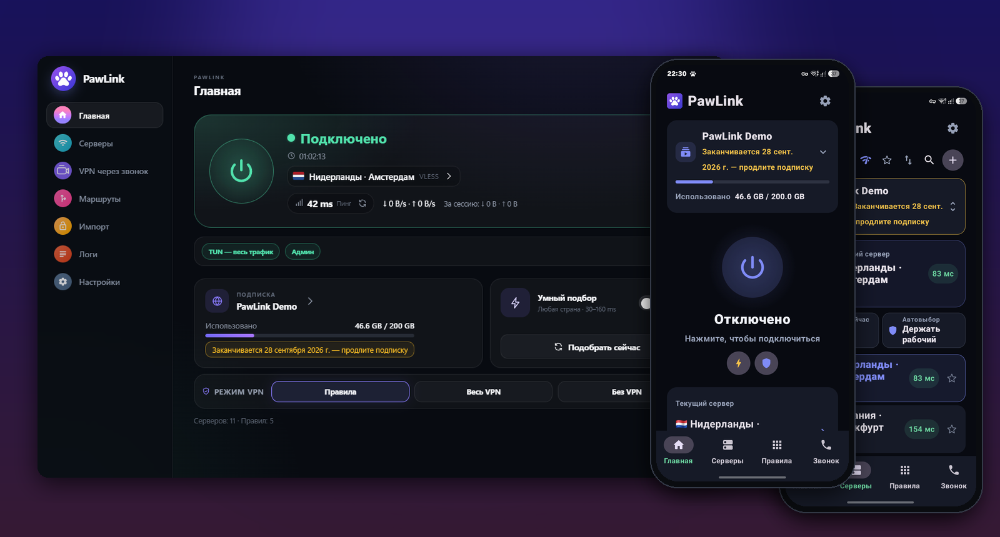

  <a href="README.en.md">English</a> · <strong>Русский</strong>

  

<h1 align="center">PawLink</h1>

  <b>Удобный и простой VPN клиент</b> 
  Для Windows и Android

  
  

  Кнопка сразу скачивает последнюю версию. Все версии и что в них нового — на странице <a href="../../releases">релизов</a>.

  

## 🐾 Три шага — и вы онлайн

| 1. Скачайте | 2. Вставьте ссылку | 3. Нажмите кнопку |
|:---:|:---:|:---:|
| Кнопкой выше, для компьютера или телефона | Ту, что выдал ваш VPN-сервис. На телефоне можно просто нажать «Поделиться» → PawLink или отсканировать QR-код | Одна большая кнопка. Зелёная — всё работает |

Больше ничего настраивать не нужно. Серверы, обновления и переподключения PawLink берёт на себя.

## Почему PawLink

**🟢 Не нужно разбираться.** Никаких конфигов и непонятных галочек. Цвет кнопки всё объясняет: зелёный — работает, жёлтый — подключаемся, красный — что-то не так, и PawLink подскажет, что именно.

**⚡ Сам выбирает лучший сервер.** Если сервер упал или стал медленным, PawLink тихо переключится на рабочий. Вы этого даже не заметите.

**📶 Не рвётся.** Сменили Wi-Fi на мобильный интернет, зашли в метро, телефон полежал в кармане — соединение восстановится само.

**📞 Работает при белых списках.** Когда мобильный интернет пускает только на «разрешённые» сайты, обычные VPN перестают работать. У PawLink есть режим **«VPN через звонок»**: для сети ваш трафик выглядит как обычный видеозвонок VK, поэтому он проходит там, где остальное блокируется.

**🎯 Правила без мучений.** Хотите, чтобы через VPN шёл только YouTube? Напишите одно слово — `youtube`, и PawLink сам поймёт, что это все сайты и видеосерверы YouTube. Можно просто вставить ссылку на сайт или выбрать готовый набор правил. На телефоне — отметьте нужные приложения галочками или нажмите «Выбрать рекомендуемые». Всё остальное, включая игры по локальной сети, работает напрямую.

**🚫 Меньше рекламы.** Блокировка рекламы включается одним переключателем.

## Для кого

- Для тех, у кого уже есть подписка на VPN и хочется удобное приложение вместо «того, что посоветовали в чате».
- Для тех, у кого мобильный интернет работает по белым спискам. Если у вас есть свой сервер, PawLink сам установит на него «VPN через звонок» и сделает ссылки с QR-кодом для друзей и семьи — нужно только ввести адрес сервера и пароль.

## Частые вопросы

<b>Где взять ссылку на подписку?</b>

 
PawLink — это приложение для подключения, а не VPN-сервис. Ссылку выдаёт сервис, у которого вы купили VPN (обычно в личном кабинете или в Telegram-боте). PawLink понимает все популярные протоколы — VLESS (в том числе Reality), VMess, Trojan, Shadowsocks, Hysteria2, TUIC, WireGuard и AmneziaWG, SOCKS и HTTP — и любые форматы: ссылку на подписку, отдельный ключ вроде <code>vless://…</code>, QR-код, файл Clash или WireGuard.

<b>Windows пишет «Система Windows защитила ваш компьютер»</b>

 
Так Windows реагирует на новые программы без платной подписи. Нажмите «Подробнее» → «Выполнить в любом случае». Права администратора нужны, чтобы через VPN шёл весь трафик, включая игры.

<b>Телефон пишет, что установка заблокирована</b>

 
Так Android защищает от приложений не из Google Play — это нужно разрешить один раз. В появившемся окне нажмите «Настройки», включите «Разрешить из этого источника», вернитесь назад и нажмите «Установить». Дальше PawLink обновляется сам, прямо в приложении.

<b>На телефоне VPN отключается в фоне</b>

 
При первом запуске PawLink покажет, что поменять: отключить экономию батареи для PawLink и «Постоянный VPN» у других приложений. После этого соединение держится, даже если закрыть приложение.

<b>Какое-то приложение не работает, пока включён VPN</b>

 
Некоторые приложения (например, банковские) не любят VPN — просто не пускайте их через него. На телефоне откройте вкладку «Правила» и выберите «Только выбранные через VPN»: через VPN пойдут только отмеченные приложения, остальные будут работать как обычно. Некоторые приложения замечают сам факт включённого VPN, даже когда их трафик идёт напрямую. На этот случай в настройках есть «Скрыть VPN от приложений»: системный VPN не создаётся, а через PawLink идут только приложения, в которых указан прокси.

<b>Что нужно для своего сервера «VPN через звонок»?</b>

 
Любой недорогой VPS: 1 ядро, от 512 МБ памяти, Ubuntu 22.04 или 24.04 и доступ по паролю или ключу. Всё остальное PawLink установит сам. Пароль от сервера хранится зашифрованным только у вас и никогда не попадает в ссылки для друзей.

<b>Это бесплатно?</b>

 
Да. Без рекламы, без регистрации и без сбора данных.

## Нашли ошибку или есть идея?

Напишите в [Issues](https://github.com/FelixEnotix/PawLink/issues) — приложите скриншот и расскажите, что делали. Это очень помогает.

  Если PawLink вам пригодился — поставьте ⭐, так его проще найти другим.

---

«VPN через звонок» основан на <a href="https://github.com/Ivan4537/WDTT-Plus">WDTT-Plus</a> (GPLv3). Флаги на Windows — шрифт Twemoji Country Flags (CC-BY 4.0). Подробности о лицензиях — в файле <a href="LICENSE">LICENSE</a>.
